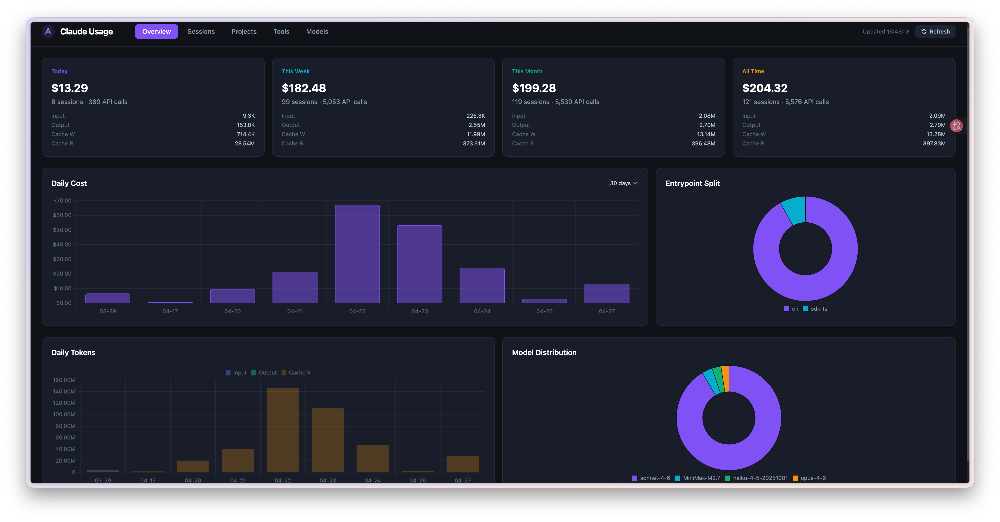
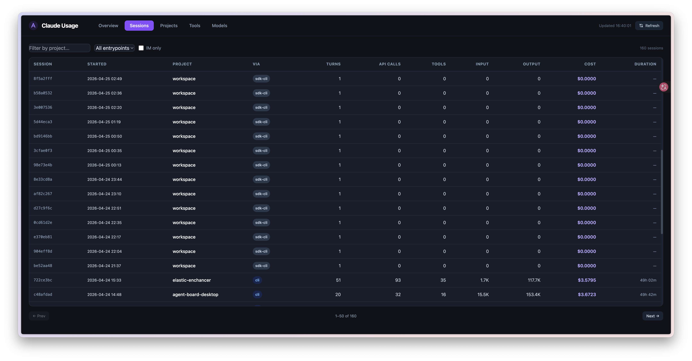
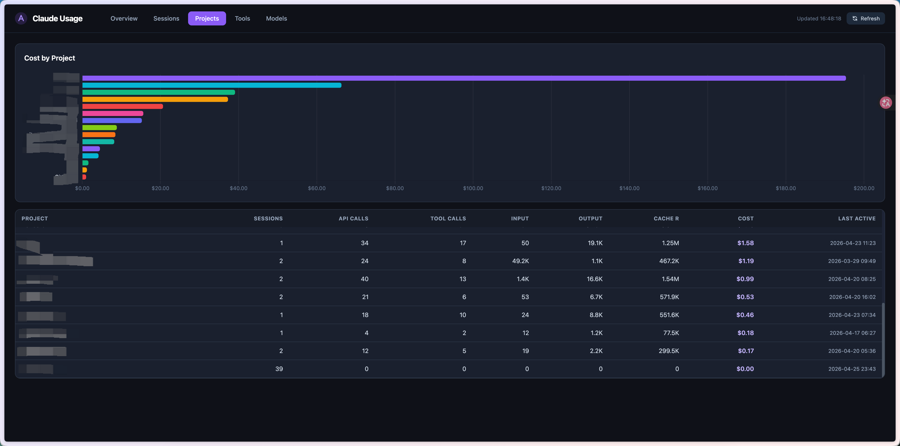
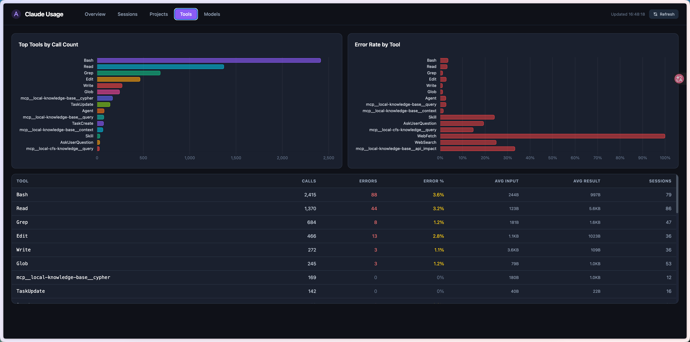
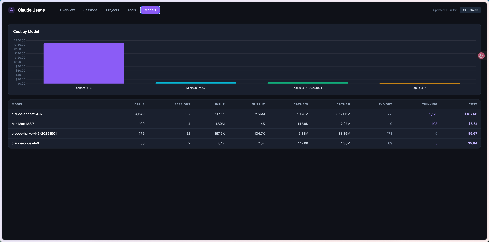

# Claude Token Tracker

Tracks token usage and cost for every Claude Code session, stores it in a local SQLite database, and serves a web dashboard for analysis.

## Screenshots











## Prerequisites

- [Claude Code](https://claude.ai/code) installed and configured
- Python 3.9+
- `flask` (`pip3 install flask`)

## Install

```bash
git clone https://github.com/xiaohaoxing/claude-token-tracker
cd claude-token-tracker
chmod +x install.sh
./install.sh
```

The installer:
1. Checks Python and Flask
2. Registers a **Stop hook** in `~/.claude/settings.json` — fires after every Claude session
3. Backfills all existing sessions from `~/.claude/projects/`

## Usage

### Web dashboard

```bash
python3 server.py          # → http://localhost:5001
python3 server.py 8080     # custom port
```

Open `http://<your-lan-ip>:5001` from any device on the same network.

**Tabs:**
| Tab | Content |
|-----|---------|
| Overview | Cost cards (today/week/month/all-time), daily cost chart, token stacked chart, entrypoint & model distribution |
| Sessions | Filterable/paginated session list with **IM badge** and "IM only" filter; click any row for per-API-call token breakdown |
| Projects | Cost by project, table with full metrics |
| Tools | Call count & error rate charts, detailed table |
| Models | Per-model token and cost breakdown |

### Stats CLI

```bash
python3 stats.py today
python3 stats.py week
python3 stats.py month
python3 stats.py total
python3 stats.py sessions [--limit N]
python3 stats.py session <session-id-prefix>
python3 stats.py tools [--limit N]
python3 stats.py projects
python3 stats.py models
python3 stats.py daily [--days N]
```

### Manual backfill

Re-scan all local sessions (safe to run multiple times — uses upsert):

```bash
python3 tracker.py --backfill ~/.claude/projects/
```

## How it works

Claude Code fires a **Stop hook** at the end of every session, passing a JSON payload to stdin:

```json
{ "session_id": "...", "transcript_path": "...", "cwd": "..." }
```

`tracker.py` reads the JSONL transcript, extracts every assistant API response (with full `usage` fields), and writes to SQLite.

### IM session detection

If you use [claude-to-im](https://github.com/anthropics/claude-to-im) to serve Claude via messaging apps (Feishu, Telegram, etc.), those sessions are automatically tagged with `im_source = 'cti'` in the database.

**How it works:** claude-to-im passes `CTI_*` environment variables to the Claude Code subprocess it spawns. The Stop hook inherits these variables. `tracker.py` checks for `CTI_RUNTIME` at hook time — if present, the session is marked as IM-originated. No configuration required.

Sessions without `CTI_RUNTIME` (direct CLI usage) have `im_source = NULL`.

> **Note:** Historical sessions backfilled via `--backfill` cannot be tagged retroactively since the runtime environment is no longer available. Only sessions recorded after install will carry the IM tag.

### Database schema

| Table | Description |
|-------|-------------|
| `sessions` | One row per session — aggregated token totals, cost, duration, entrypoint, `im_source` |
| `api_calls` | One row per API response — input/output/cache tokens, model, stop reason, tool count |
| `tool_calls` | One row per tool invocation — tool name, input size, result size, error status |
| `daily_summary` | Pre-aggregated daily rollup for fast dashboard queries |

### Cost model

Costs are estimated using Anthropic's published pricing per model family.
The `api_calls` table records raw token counts — you can recompute cost at any time if pricing changes.

## Uninstall

```bash
./uninstall.sh
```

Removes the hook from `~/.claude/settings.json`. The database at `~/.claude/token-tracker/token_stats.db` is preserved.

## File structure

```
claude-token-tracker/
├── tracker.py        # Stop hook script + backfill mode
├── stats.py          # CLI query tool
├── server.py         # Flask web dashboard
├── templates/
│   └── index.html    # Single-page frontend (Tailwind + Chart.js)
├── static/
│   ├── tailwind.min.js
│   └── chart.min.js
├── install.sh
└── uninstall.sh
```
