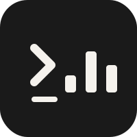

# Claude Token Tracker



[English](#english) | [中文](#中文)

---

<a name="english"></a>
## English

Track your Claude Code usage — tokens, cost, and sessions — in a local SQLite database, and explore the data through a web dashboard.

### Screenshots


### Prerequisites

- [Claude Code](https://claude.ai/code) installed and configured
- Python 3.9+
- Flask: `pip3 install flask`

### Install

```bash
git clone https://github.com/xiaohaoxing/claude-token-tracker
cd claude-token-tracker
chmod +x install.sh
./install.sh
```

The installer:
1. Checks Python and Flask
2. Registers a **Stop hook** in `~/.claude/settings.json` — fires automatically after every Claude Code session
3. Backfills all existing sessions from `~/.claude/projects/`

After install, new sessions are tracked automatically — no manual steps needed.

### Web Dashboard

```bash
python3 server.py          # → http://localhost:5001
python3 server.py 8080     # custom port
```

Also accessible from other devices on the same LAN: `http://<your-lan-ip>:5001`

**Dashboard tabs:**

| Tab | What you'll see |
|-----|-----------------|
| Overview | Today / week / month / all-time cost cards, daily cost chart, token breakdown chart, entrypoint & model distribution |
| Sessions | Full session list with search/filter; click any row to drill into per-API-call detail |
| Projects | Cost and token usage grouped by project directory |
| Tools | How often each tool was called, error rates, average input/output sizes |
| Models | Per-model token counts and cost |

### When does a new session appear?

Sessions are recorded by a **Stop hook** — it fires when Claude Code finishes a response. So the very latest turn of an ongoing session may not appear until the session ends or you run a manual backfill:

```bash
python3 tracker.py --backfill ~/.claude/projects/
```

This is safe to run multiple times (uses upsert).

### IM Session Tagging

If you use [claude-to-im](https://github.com/anthropics/claude-to-im) to access Claude via messaging apps (Feishu, Telegram, etc.), sessions originating from IM are automatically tagged with an **IM** badge in the Sessions tab.

No configuration needed — the tracker detects the `CTI_RUNTIME` environment variable that claude-to-im passes to the Claude Code subprocess.

> Historical sessions backfilled via `--backfill` cannot be tagged retroactively, since the runtime environment is no longer available.

### Stats CLI

Quick stats without opening the browser:

```bash
python3 stats.py today
python3 stats.py week
python3 stats.py month
python3 stats.py total
python3 stats.py sessions [--limit N]
python3 stats.py session <session-id-prefix>
python3 stats.py tools [--limit N]
python3 stats.py projects
python3 stats.py models
python3 stats.py daily [--days N]
```

### Uninstall

```bash
./uninstall.sh
```

Removes the hook from `~/.claude/settings.json`. The database at `~/.claude/token-tracker/token_stats.db` is preserved.

### Database Location

Default: `~/.claude/token-tracker/token_stats.db`

Override with an environment variable:

```bash
CLAUDE_TRACKER_DB=/path/to/custom.db python3 server.py
```

---

<a name="中文"></a>
## 中文

自动追踪 Claude Code 的 token 用量和费用，数据存储在本地 SQLite 数据库中，并提供一个 Web 看板供查阅分析。

### 前置条件

- 已安装并配置 [Claude Code](https://claude.ai/code)
- Python 3.9+
- Flask：`pip3 install flask`

### 安装

```bash
git clone https://github.com/xiaohaoxing/claude-token-tracker
cd claude-token-tracker
chmod +x install.sh
./install.sh
```

安装脚本会：
1. 检查 Python 和 Flask 是否可用
2. 在 `~/.claude/settings.json` 中注册一个 **Stop hook**，每次 Claude Code 会话结束后自动触发
3. 将 `~/.claude/projects/` 中已有的历史会话一次性导入数据库

安装完成后，新会话会自动被追踪，无需手动操作。

### 启动 Web 看板

```bash
python3 server.py          # → http://localhost:5001
python3 server.py 8080     # 自定义端口
```

同一局域网内的其他设备也可访问：`http://<你的局域网IP>:5001`

**看板页签说明：**

| 页签 | 内容 |
|------|------|
| 总览 | 今日 / 本周 / 本月 / 累计费用卡片，每日费用折线图，token 分类堆叠图，入口和模型分布 |
| 会话 | 完整会话列表，支持搜索和筛选；点击任意行可查看该会话每次 API 调用的 token 明细 |
| 项目 | 按项目目录汇总的费用和 token 用量 |
| 工具 | 各工具的调用次数、报错率、平均输入/输出大小 |
| 模型 | 各模型的 token 用量和费用占比 |

### 新会话什么时候出现？

数据通过 **Stop hook** 写入，即每次 Claude Code 完成一条响应后触发。因此，正在进行中的会话最后几轮可能还未入库，可以手动触发补录：

```bash
python3 tracker.py --backfill ~/.claude/projects/
```

该命令使用 upsert，重复执行不会产生重复数据。

### IM 会话标记

如果你使用 [claude-to-im](https://github.com/anthropics/claude-to-im) 通过飞书、Telegram 等 IM 工具访问 Claude，来自 IM 的会话会在「会话」页签中自动显示 **IM** 标签。

无需任何额外配置，追踪器会自动检测 claude-to-im 注入的 `CTI_RUNTIME` 环境变量。

> 通过 `--backfill` 补录的历史会话无法追加 IM 标记，因为历史会话的运行时环境已不可用。

### 命令行快捷查询

不想打开浏览器时，可以用命令行快速查看统计：

```bash
python3 stats.py today          # 今日
python3 stats.py week           # 本周
python3 stats.py month          # 本月
python3 stats.py total          # 累计
python3 stats.py sessions       # 会话列表
python3 stats.py projects       # 项目汇总
python3 stats.py models         # 模型汇总
python3 stats.py tools          # 工具统计
python3 stats.py daily          # 每日明细
```

### 卸载

```bash
./uninstall.sh
```

仅移除 `~/.claude/settings.json` 中的 hook 注册，数据库文件 `~/.claude/token-tracker/token_stats.db` 会保留。

### 数据库路径

默认位置：`~/.claude/token-tracker/token_stats.db`

可通过环境变量自定义：

```bash
CLAUDE_TRACKER_DB=/path/to/custom.db python3 server.py
```

---

## File Structure

```
claude-token-tracker/
├── tracker.py        # Stop hook script + backfill mode
├── stats.py          # CLI query tool
├── server.py         # Flask web dashboard
├── templates/
│   └── index.html    # Single-page frontend (Tailwind + Chart.js)
├── static/
│   ├── tailwind.min.js
│   └── chart.min.js
├── install.sh
└── uninstall.sh
```
